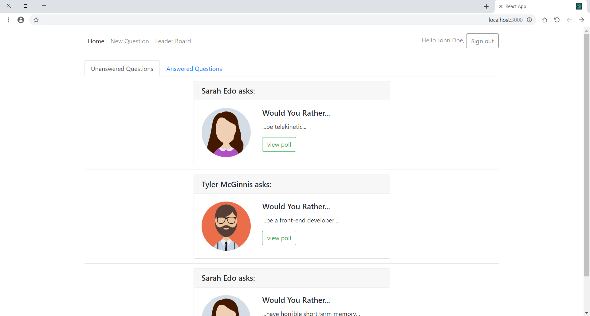
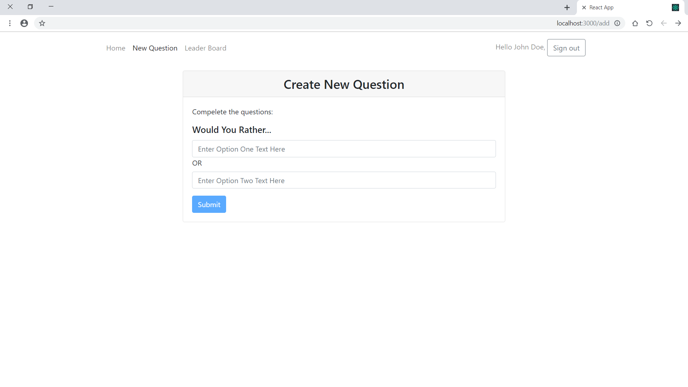
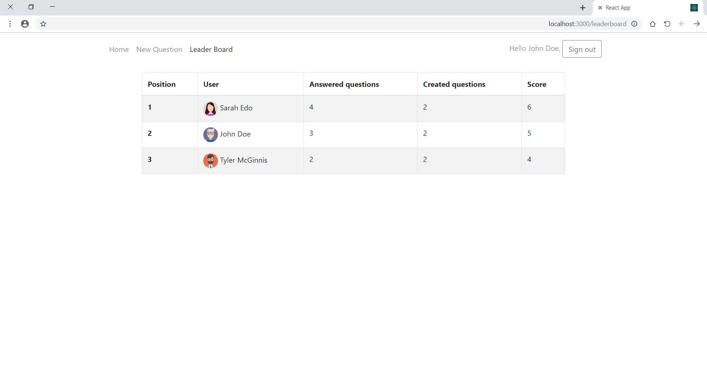

This project was bootstrapped with [Create React App](https://github.com/facebook/create-react-app).

# Would You Rather App

It's a project for Udacity's React Fundamentals course.

## Getting Start

To run the app:

* install all project dependencies with `npm install`
* start the development server with `npm start`

#### Login page
choose a user from the dropdown list

#### Unanswered questions view

#### Add New Question

#### LeaderBoard

